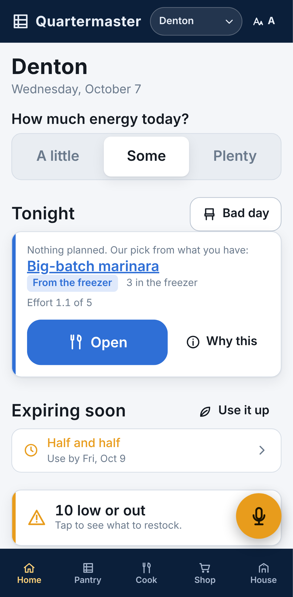
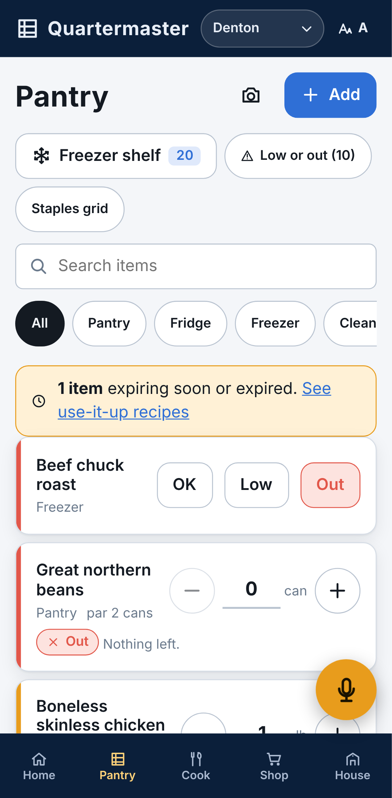
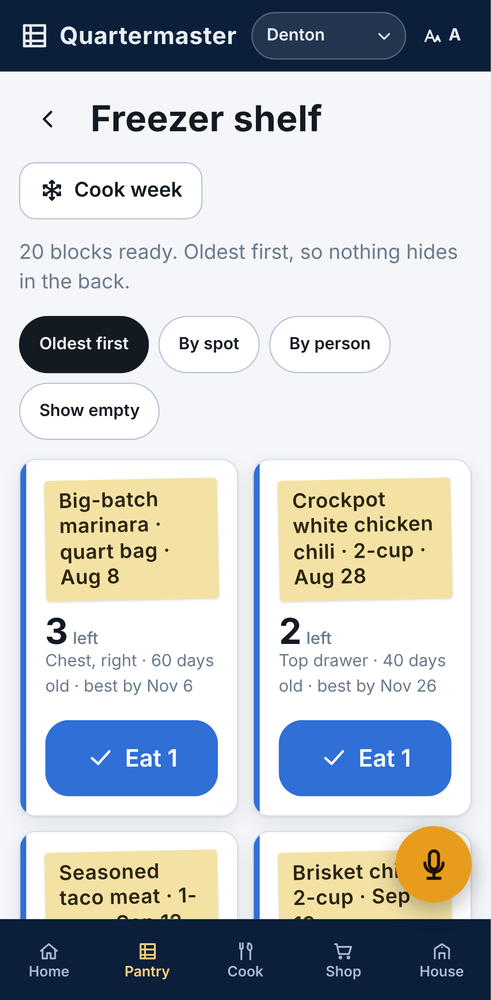
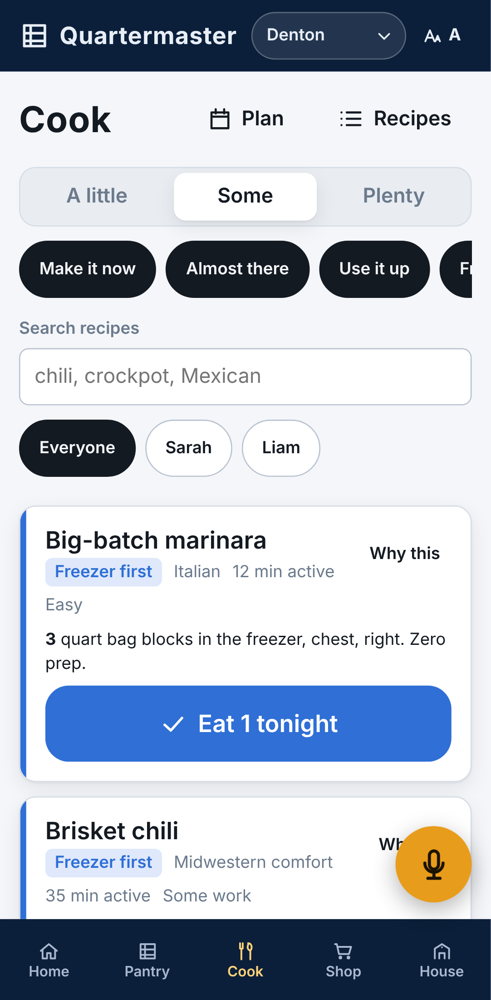
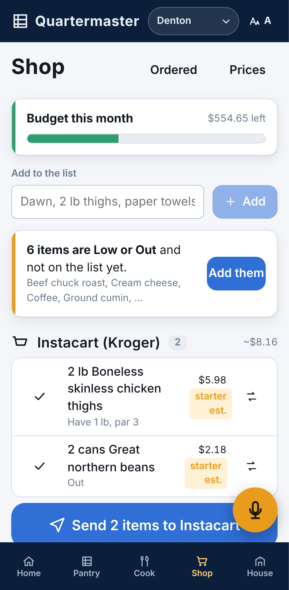
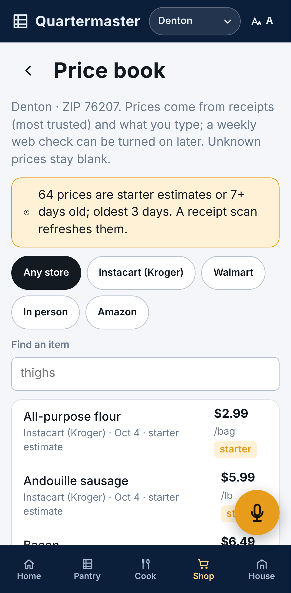
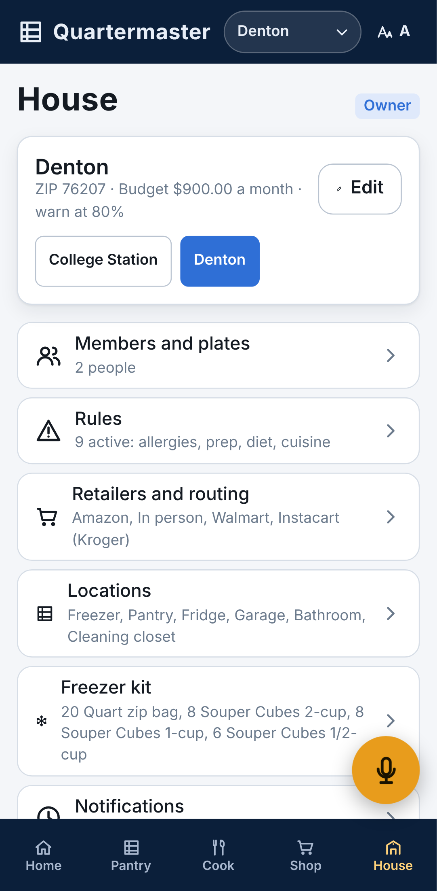
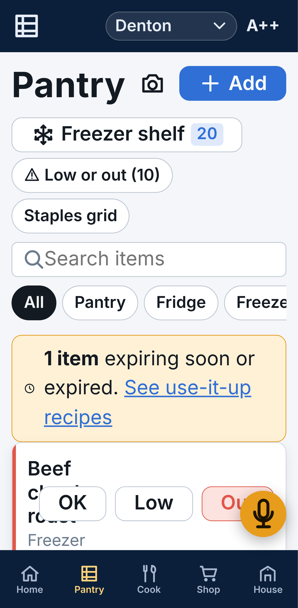

# Quartermaster

A voice-first, multi-household app that knows what is in the house, tells you what you can cook from it, plans the week and the freezer batches, and pushes the gaps to Instacart, H-E-B, Walmart, Amazon, or a plain list. It replaces Neelix's Kitchen.

Spec: `docs/spec.md`. Readiness review: `docs/spec-review.md`. Build plan: `docs/implementation-plan.md`.

## Run it

```bash
npm install
npm run dev        # http://localhost:5173, local mode (no account), seeded with Denton and College Station
```

With no Supabase keys the app runs entirely in the browser (IndexedDB). Reset the demo under House, Export and reset. With keys, reads come from an IndexedDB mirror and writes queue in an outbox when offline; the header shows "N changes waiting" until they flush.

## Connect Supabase

1. Create a Supabase project. Apply the migrations in order with the SQL editor or the CLI:
   `supabase/migrations/0001_init.sql`, `0002_rls.sql`, `0003_functions.sql`, `0004_realtime.sql`.
2. In Authentication, turn off public sign-ups and enable email OTP. Create the first user with the dashboard or `auth.admin.inviteUserByEmail`.
3. Copy `.env.example` to `.env` and set `VITE_SUPABASE_URL` and `VITE_SUPABASE_PUBLISHABLE_KEY`.
4. Sign in, then call `create_household('Denton', 'America/Chicago', '76207', 'souper_cubes')` once (House, Start another household does this from the app).

Every table has row level security; a user sees only households they belong to. Roles: owner, editor, viewer, agent (for Riker).

Push notifications (House > Notifications > "Notifications on this phone") need a VAPID key pair: run `npx web-push generate-vapid-keys` once, put the public key in `.env` as `VITE_VAPID_PUBLIC_KEY`, and set `VAPID_PUBLIC_KEY`, `VAPID_PRIVATE_KEY` and `VAPID_SUBJECT` (a `mailto:` address) as secrets on the `notify` edge function (`supabase functions deploy notify`). The hourly `.github/workflows/notify.yml` calls it with the repository's `SUPABASE_URL` and `SUPABASE_SERVICE_ROLE_KEY`; it batches low/out at 5 pm, expiring and expired at 8 am, the weekly shop and stale-price reminders, the budget lines, and "list sent" rows queued by a database trigger, respecting quiet hours and each person's toggles. Without the key the phone toggle explains that push is not set up; in local mode the subscription is saved on the device only. See `supabase/functions/README.md`.

## What it looks like

Phone-size captures of the seeded Denton household, from `scripts/screenshot.mjs` against `npm run preview`:

| Home | Pantry | Freezer shelf | Cook |
| --- | --- | --- | --- |
|  |  |  |  |

| Shop | Price book | House | Pantry at A++ |
| --- | --- | --- | --- |
|  |  |  |  |

## CI

`.github/workflows/ci.yml` runs typecheck, lint, unit tests, build, the SQL tenancy tests, and the Playwright flows on every push and pull request. `price-check.yml` runs the weekly web price check once the Supabase secrets exist.

## Checks

```bash
npm run typecheck   # tsc
npm run lint        # oxlint
npm test            # vitest: domain rules, local adapter, feature render tests
npm run db:test     # applies the migrations to a throwaway local Postgres and runs the tenancy tests
npm run test:e2e    # Playwright on a Pixel 7 profile (set PW_CHROMIUM_PATH to a local Chromium if needed)
npm run build       # production PWA in dist/
```

`npm run db:types` regenerates `src/data/supabase/database.types.ts` from the local database.

## Layout

```
src/domain         pure rules: units, matching, status, rules engine, suggestions, lists, containers, labels, plan, budget, nutrition, Neelix import
src/data           Repository interface, local IndexedDB adapter, Supabase adapter, demo seed, mutation helpers with undo
src/features       home, pantry, cook, shop, house, partner
src/design         tokens, base styles, components
src/integrations   retailer send adapters, share and print helpers, price web-check interface
supabase           migrations, SQL tests, local Postgres scripts
e2e                Playwright flows
```

## Phase status

Phase 1 (Foundation) is built in local mode: pantry (status and count), freezer shelf with labels, recipe bank, four suggestion modes with explainable scores, week plan with fill and plan-to-list, cook-week builder with container math, cook mode, one shopping list with per-retailer send, price book, budget, rules engine, A/A+/A++, undo everywhere, activity feed, Neelix import, multi-household data model with RLS. Also built ahead of the roadmap: a local rule-based partner (type or dictate "we're out of eggs and low on butter", confirm, undo), email one-time-code sign-in with invite links and first-run setup, an offline mirror with a write queue for Supabase mode, and the `instacart-link` edge function (needs an Instacart Developer Platform key). Still schema-only or stubbed: push notifications (preferences stored).

Phase 3 intake is built and waits on a live project: four edge functions under `supabase/functions` (`parse-intent`, `url-import`, `recipe-generate`, `receipt-parse`) run as the signed-in user with per-household daily caps in `ai_usage`, strict JSON, and page text and photos treated as data. In the app, the partner asks the server parser first and falls back to its local rules (and says which answered), the recipe bank has "Import from URL" and "Make me a recipe" sheets that preview before one undoable save, and `/pantry/scan` reads a barcode (camera where the browser can, typed code anywhere) against Open Food Facts and turns a receipt photo, or typed lines in local mode, into a review list that writes prices, a spend row, receipt rows and restocks as one undoable change. Each needs `ANTHROPIC_API_KEY` on the functions and a private `receipts` storage bucket; see `supabase/functions/README.md`.
